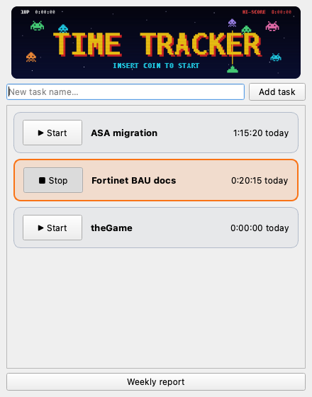
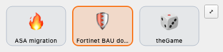
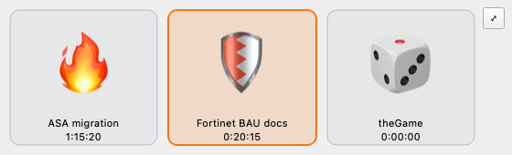

<p align="center">
  
</p>

# ⏱️ timeTrackerTool

> *"This is a very, very special app. It has many, many, many features."*
> — Cmdt. E. Lassard (probably)


-41cd52)


A cross-platform (Windows + macOS) desktop app for tracking time spent on your
tasks — one big button per task, one honest number at the end of the week.
Click a task to start its clock; click another and the first one stops,
because you can only actually do one thing at a time (controversial, we know).

---

## 📸 What it looks like

<p align="center">
  
</p>

Each task lives in its own card. The running task glows orange and its
"today" total ticks up live. The invaders at the top are decorative but
judgmental.

## ✨ Features (many, many, many of them)

- 🕹️ **One button per task** — configure as many tasks as you like; each gets
  a Start/Stop toggle in its own bordered card.
- 🐭 **Mini mode** — one click shrinks the app to a tiny always-on-top,
  resizable strip of emoji buttons, each with a short name label. Pick each
  task's emoji via right-click → a proper picker dialog (quick-pick grid of
  32, or type anything — the OS emoji palette works in it too: ⌃⌘Space on
  macOS, Win+. on Windows). The emoji scale with the window; make it big
  enough and each button also shows today's tracked time.

  
  
- ⏱️ **Cumulative daily timers** — every click adds to *today's* total for
  that task, displayed live to the second.
- 🎯 **Single-active tracking** — starting a task stops the running one. No
  accidental double-billing your own life.
- 🟢 **Start flash** — the moment a timer is accepted, its card (and mini
  button) pulses green so you know the click landed.
- 💾 **Local-first storage** — everything lives in one SQLite file on your
  machine. No cloud, no account, no telemetry, no nonsense.
- 🛡️ **Crash-tolerant** — time is flushed to disk every ~10 seconds and on
  close; a crash costs you seconds, not hours.
- 🌙 **Midnight-aware** — leave a timer running past midnight and the seconds
  are booked to the correct days, and every card's "today" total rolls over
  to the new day live. Night owls are people too.
- 🚪 **Quit-safe** — pending time is banked on close *and* on app quit, even
  when quitting from mini mode where the main window is hidden.
- 💤 **Idle detection** — leave for 5+ minutes with a timer running and when
  you return the app asks whether to keep or discard the away gap. Uses the
  OS idle counters directly (no extra dependencies), split correctly across
  midnight if you vanish for that long.
- 📍 **Menu-bar / tray icon** — start/stop any task, open the app, jump to
  mini mode, or quit, all from the macOS menu bar or Windows system tray.
  The tooltip shows what's running and today's total.
- 🔒 **Single-instance** — launching a second copy just brings the running
  one to the front instead of opening two windows on the same database.
  Crash-safe: a stale lock from a killed instance is detected and cleared.
- 📤 **CSV export + monthly view** — the report dialog toggles between week
  and month, pages through either, and exports the current view as CSV
  (ISO-dated columns, seconds, ready for a spreadsheet).
- 🔀 **Cross-machine merge** — every time entry records which machine wrote
  it, so `poetry run timetracker-merge <other.db>` combines your Mac and
  Windows histories with no double-counting, no matter how often you re-run
  it. Reports sum across machines automatically.
- ☁️ **Auto-sync via any shared folder** — point Settings (☰) at a Dropbox/
  OneDrive folder and each machine publishes its history there and merges
  everyone else's, automatically on launch and quit. Manual CLI no longer
  required — your machines just converge.
- 🚀 **Launch at login** — one checkbox in Settings registers the app as a
  macOS LaunchAgent / Windows Run entry, packaged or from source.
- 🎯 **Daily target bar** — set your hours (default 7.5) and a progress bar
  fills as the day accumulates across all tasks. Beat it and the bar says
  so, arcade-style.
- ⏰ **Forgot-me nudges** — a system notification if a timer is still running
  past your evening cutoff, or if nothing has been tracked by mid-morning.
  Once per day each, both configurable or offable.
- 🧠 **Send to Obsidian** — one button in Reports writes the current week or
  month as a formatted markdown note (frontmatter, totals table, day-by-day
  table) straight into your vault's inbox folder.
- 🪪 **Stable generated IDs** — each task gets an 8-character ID at creation;
  all logged time hangs off the ID, so renaming a task never orphans its
  history.
- 📊 **Weekly report** — a Monday-to-Sunday day-by-day grid per task with
  day totals and a grand total; page backwards through past weeks.
- 🗂️ **Rename & archive** — right-click any task card. Archived tasks vanish
  from the main window but keep their history and still appear in reports.
- 🧹 **Archive manager** — the **Archived…** button lists archived tasks with
  their total logged time; restore any of them, or **Delete forever** (task
  plus all its logged time, behind a can't-miss confirmation).
- 👾 **100% code-drawn artwork** — the arcade banner and the app icon (a
  seven-segment LCD clock reading **13:37**, because of course it does) are
  generated by a script. There are no image source files to lose. Ever.
- 🕹️ **The banner is ALIVE** — the invaders march back and forth, the stars
  twinkle, INSERT COIN blinks, and the **1UP counter is your real tracked
  time today** (HI-SCORE is your daily target). At random intervals a red
  saucer blasts across and shoots every invader — each explodes — and the
  formation respawns moments later. This feature was requested with the
  words "Too much?!" and the answer was no. (If it *is* too much for you,
  Settings (☰) has an "Animated banner" switch — off freezes it to a calm
  static frame.)

## 💻 System requirements

| | Minimum |
|---|---|
| **macOS** | macOS 12 Monterey or later (Apple Silicon or Intel) |
| **Windows** | Windows 10 (21H2) or Windows 11, 64-bit |
| **Python** | 3.11, 3.12, or 3.13 — **not 3.14+** (PySide6 pin; see install notes) |
| **Disk** | ~1 GB free (Qt is a big lad) |
| **RAM** | 4 GB is plenty |
| **Network** | Only needed during install — the app itself is fully offline |

> 📦 You can build a **double-clickable app** (macOS `.app` / Windows `.exe`)
> with one command — see *Packaging* below. The Python toolchain is needed
> once, to run that build (or to run from source). ~10 minutes from a bare
> machine.

## 🚀 Quick start (already have Python + Poetry)

```bash
git clone git@github.com:jflockton/timeTrackerTool.git
cd timeTrackerTool
poetry install
poetry run timetracker
```

Type a task name, press Enter, hit **▶ Start**, and get to work — the
hi-score table is watching.

## 🍎 Installing from scratch — macOS

1. **Install Python 3.13** (skip if `python3 --version` already says 3.11–3.13):
   - Easiest: download the **3.13** macOS installer from
     [python.org/downloads](https://www.python.org/downloads/) — pick 3.13
     specifically, **not** the newest 3.14+.
   - Or with Homebrew: `brew install python@3.13`
2. **Install Poetry** (the dependency manager) in Terminal:
   ```bash
   curl -sSL https://install.python-poetry.org | python3 -
   ```
   Then restart Terminal so the `poetry` command is found (the installer adds
   it to `~/.local/bin` — it prints the exact PATH line to add if needed).
3. **Get the code** — either:
   ```bash
   git clone git@github.com:jflockton/timeTrackerTool.git
   ```
   or, without git: GitHub → **Code ▾ → Download ZIP**, then unzip.
4. **Install and run:**
   ```bash
   cd timeTrackerTool
   poetry env use python3.13   # only needed if you have several Pythons
   poetry install
   poetry run timetracker
   ```

## 🪟 Installing from scratch — Windows

1. **Install Python 3.13**: download the **3.13** Windows 64-bit installer
   from [python.org/downloads/windows](https://www.python.org/downloads/windows/)
   — pick 3.13 specifically, **not** the newest 3.14+.
   ⚠️ On the first installer screen, tick **"Add python.exe to PATH"**.
2. **Install Poetry** in PowerShell:
   ```powershell
   (Invoke-WebRequest -Uri https://install.python-poetry.org -UseBasicParsing).Content | py -
   ```
   Then close and reopen PowerShell. If `poetry` isn't found, add
   `%APPDATA%\Python\Scripts` to your PATH (the installer prints this too).
3. **Get the code** — `git clone git@github.com:jflockton/timeTrackerTool.git`
   (needs [Git for Windows](https://git-scm.com/download/win)), or GitHub →
   **Code ▾ → Download ZIP** and extract.
4. **Install and run:**
   ```powershell
   cd timeTrackerTool
   poetry env use py3.13       # only needed if you have several Pythons
   poetry install
   poetry run timetracker
   ```

## 📦 Packaging — build the double-clickable app

On the machine you're building **for** (PyInstaller doesn't cross-compile):

```bash
poetry install                            # includes the build tooling
poetry run python scripts/build_app.py
```

- **macOS** → `dist/timeTrackerTool.app` with a proper `.icns` (Dock,
  Cmd-Tab, Finder — the icon shows everywhere). Drag it into /Applications.
- **Windows** → `dist/timeTrackerTool/timeTrackerTool.exe` with the `.ico`
  embedded (Explorer, taskbar, shortcuts). Pin it wherever you like.

The packaged app is self-contained — the target machine doesn't need Python
at all. It uses the same data file as running from source, so you can switch
between the two freely.

## 🔀 Two machines? Syncing your history

Each machine tracks into its own local file, stamped with the machine's name.

**The easy way:** open Settings (☰) on both machines and point *Sync folder*
at the same shared folder (Dropbox, OneDrive, a network share). Done — each
machine publishes its snapshot there and absorbs the others' automatically on
every launch and quit ("Sync now" in Settings forces it immediately).

**The manual way** (one-off merges, USB stick, etc.):

```bash
poetry run timetracker-merge /path/to/other/timetracker.db
```

Either way it's safe to repeat — entries are keyed per machine, so nothing is
ever double-counted. Reports automatically sum across machines.

## 🔄 Updating

```bash
cd timeTrackerTool
git pull          # (or re-download the ZIP)
poetry install    # picks up any new dependencies
```

Your tracked time is never touched by updates — it lives outside the code
folder (see the data-location table below), and schema changes migrate
automatically on first launch.

## 🩹 Install troubleshooting

- **`poetry: command not found`** — the installer's bin folder isn't on your
  PATH yet; restart the terminal first, then add the path it printed.
- **Poetry complains about the Python version / PySide6 won't resolve** —
  you're on Python 3.14+ or 3.10-or-older. Install 3.13 and run
  `poetry env use python3.13` (macOS) / `poetry env use py3.13` (Windows)
  inside the project folder.
- **`poetry install` is slow the first time** — that's the ~700 MB Qt
  download. Once cached, reinstalls are quick.
- **Windows says "python was not found"** — reinstall Python and tick
  *Add python.exe to PATH*, or use the `py` launcher instead of `python`.

## 🧠 How it works

| Module | Job |
|---|---|
| `core.py` | Pure timer engine — no Qt, no SQL. Start/stop/toggle, pending-time bookkeeping, midnight splitting. |
| `db.py` | SQLite schema + repository. Tasks, cumulative per-day time entries, generated IDs. |
| `report.py` | Builds the weekly day-by-day breakdown as plain data (+ a text renderer). |
| `app.py` | The only Qt-aware module: main window, task cards, report dialog. |

**Data model:** two tables. `tasks` (generated `task_id`, name, archived flag)
and `time_entries` (`task_id`, `entry_date`, cumulative `seconds` — one row
per task per day, upserted).

**Where your data lives:**

| Platform | Path |
|---|---|
| macOS | `~/Library/Application Support/timeTrackerTool/timetracker.db` |
| Windows | `%APPDATA%\timeTrackerTool\timetracker.db` |
| Linux | `~/.local/share/timeTrackerTool/timetracker.db` |
| Anywhere | Override with the `TIMETRACKER_DB` environment variable |

## 🛠️ Development

```bash
poetry run pytest -q                        # 32 tests; GUI tests run offscreen
poetry run python scripts/make_assets.py    # regenerate icon + banner artwork
```

Tests follow a strict split: the timer engine, repository, and report builder
are tested as pure Python with in-memory SQLite; the GUI has offscreen smoke
tests with deterministic Qt teardown (ask us about the segfault sometime).
The banner animation is a frame-steppable state machine with an injectable
RNG, so even the saucer's kill-run is deterministic under test.

**CI:** every push runs the full suite on macOS and Windows via GitHub
Actions (`.github/workflows/tests.yml`) — Windows breakage gets caught
before anyone sits at the Windows box.

## 🗺️ Roadmap (in no particular order, like recruits on parade)

- [x] 📦 Package as a double-clickable app with a proper `.icns`/`.ico`
- [x] 📤 CSV export + monthly view
- [x] 💤 Idle detection
- [x] 🔒 Single-instance guard
- [x] 📍 Menu-bar / tray presence
- [x] 🔀 Cross-machine merge tool
- [x] 👾 Animate the banner invaders (+ saucer strafing runs, live 1UP score)
- [x] 🤖 CI — tests run on macOS + Windows on every push (GitHub Actions)
- [ ] 🪟 Test on Windows (build the .exe there and give it a real day)

## ❓ FAQ

**Is my data sent anywhere?**
No. One local SQLite file. That's the whole story.

**What happens if I never click Stop?**
Midnight splitting books the hours to the right days, and the weekly report
will quietly suggest you get some sleep.

**Why is the hi-score 8:00:00?**
Beat a full working day of tracked time and you may update it.

**Can I have many, many, many tasks?**
Yes. Many, many, many. The list scrolls.

**I track on two machines — do I get one timesheet?**
Yes: copy one machine's data file to the other and run
`timetracker-merge` (see *Two machines?* above). Entries are stamped per
machine, so merging is repeat-safe.

**What happens if I wander off with a timer running?**
After 5 idle minutes, the app notices. When you come back it asks whether
the away time was real work (thinking counts!) or should be discarded.

---

*Built with Python, Qt, SQLite, and an unreasonable commitment to
code-drawn pixel art.* 👾
